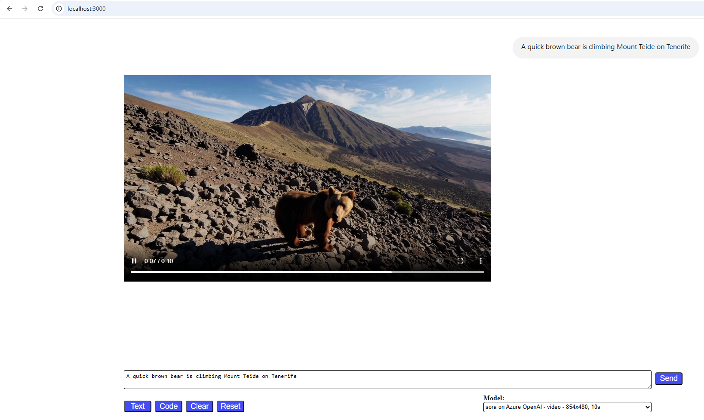
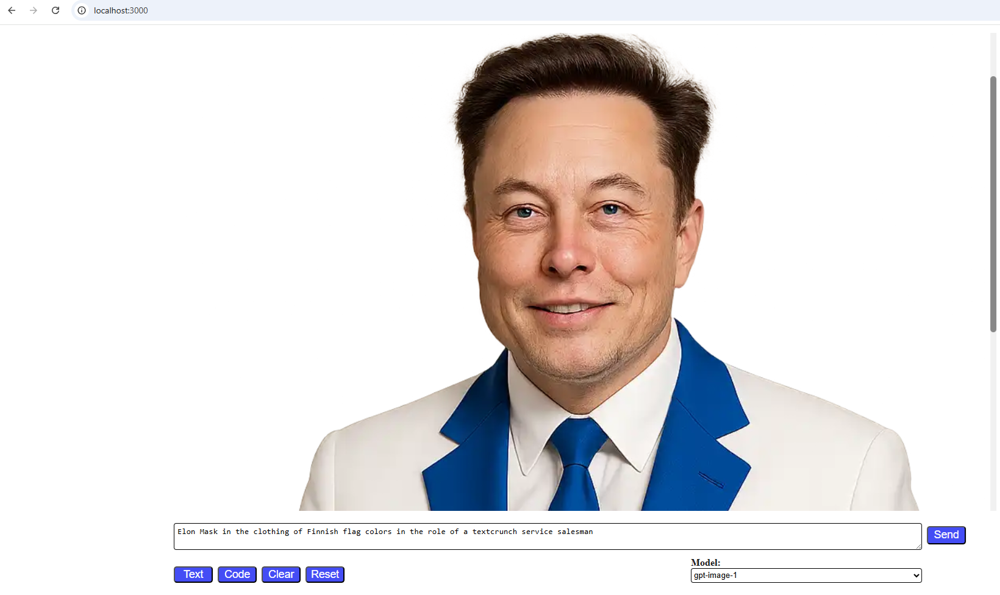
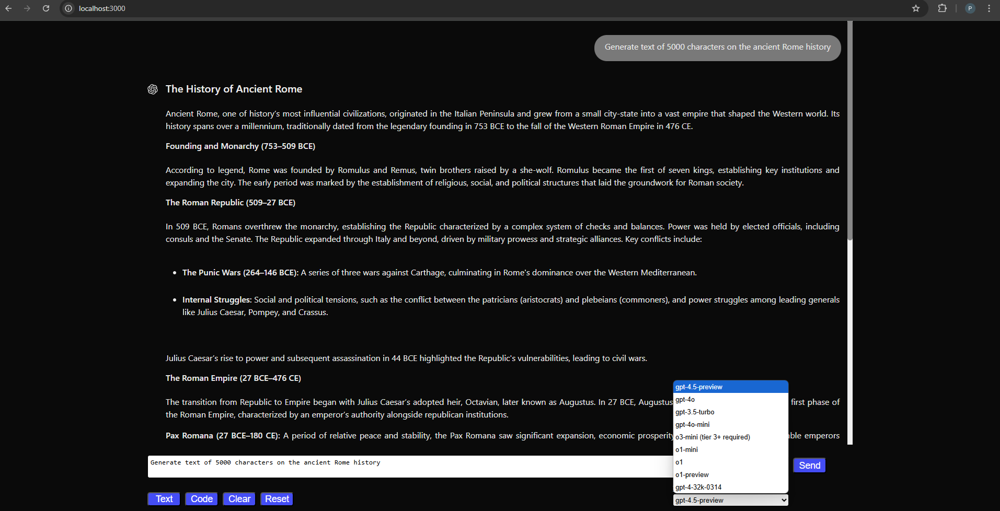
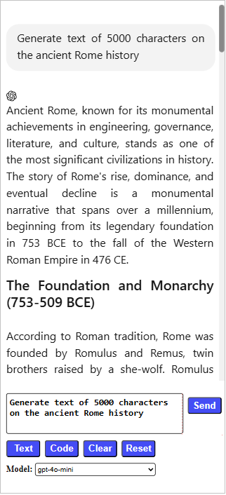

# Overview

This is a minimal Express.js server with a simple-to-use web client that works with Azure OpenAI and OpenAI endpoints.

Current version supports the API of /v1/responses and classic /v1/chat/completions as well as streaming audio and DeepSeek models.

The server can be started quickly in VSCode and in the local docker container. I host the server on the Azure Container App.

This server supports:

- Key and keyless Entra ID authentication for Azure OpenAI.
- Image generation using **gpt-image-1** and realtime audio chat with **gpt-4o-realtime-preview**.
- Streaming outputs in OpenAI and Azure OpenAI, cancelling the streaming request with the **Stop** button.
- Options to formatting AI outputs for code blocks and markdown content.
- Working with chat history context. Samples for code generations and text prompts.
- Error handling and fallback logic to plain request handling when the streaming option is not supported by the selected language model.
- Handling of OpenAI audio streaming.

Technical stack:

- Node.js, Express server, OpenAI module, @azure/identity for API key and keyless Entra ID authentication, plain JavaScript, and index.html.
- highlight.js, marked.js

### Updates and bug fixes:

**August 9, 2025, v1.1.34**
- Added support for Google video models - see [index.html](public/index.html):
  - veo-3.0-generate-preview – outputs video with sound
  - veo-3.0-fast-generate-preview – outputs video with sound
  - veo-2.0-generate-001 – legacy model; flexible video length (5–8 s), aspect ratios 16:9 or 9:16, **no** sound
- To use these models:
  - Register at https://console.cloud.google.com
  - Create a project at https://console.cloud.google.com/cloud-resource-manager
  - Obtain an API KEY from https://aistudio.google.com/app/apikey, and save add to your .env file as GEMINI_API_KEY=\<your apikey\> (see .env.example for reference).
  - Set up at least "pay-as-you-go" billing - Google video models are not free.
  - Details on pricing: https://ai.google.dev/gemini-api/docs/pricing

  [](https://raw.githubusercontent.com/Paul-Borisov/minimal-azure-openai-express-html-with-streaming/main/docs/images/american-man-is-talking-about-classic-sports-cars.mp4)
  [](https://raw.githubusercontent.com/Paul-Borisov/minimal-azure-openai-express-html-with-streaming/main/docs/images/finnish-man-is-talking-about-classic-sports-cars.mp4)

**August 7, 2025, v1.1.33**
- Added support for the models gpt-5, gpt-5-mini, gpt-5-nano, gpt-5-chat-latest.
  - The models gpt-5-mini, gpt-5-nano, gpt-5-chat are also available on Azure OpenAI.
- Improved generations of long Sora videos (15s+) to support deployments to Azure Container Apps.
  - Azure Container Apps (ACA) have the the problem with too short timeouts that abrupt long running requests after 4 min.
  - The hotfix proposed by Microsoft does not work correctly as of today.
  - I separated the logic for image generation and job status polling. This solved the problem with ACA timeouts.

**June 15, 2025, v1.1.32**
- Added support for Azure OpenAI Sora model (preview).
  - This model is available on eastus2 deployments of Azure OpenAI. It does not support keyless authentication yet.
- Sora supports the following output resolution dimensions:
  - 480x480, 480x854, 854x480, 720x720, 720x1280, 1280x720, 1080x1080, 1080x1920, 1920x1080.
  - Sora supports video durations from 1 to 20 seconds — videos at the 20-second limit are capped at 1080×1080 resolution.
    - Generating a 5-second video usually takes less than a minute.
    - Generating a 15- to 20-second video usually takes three to five minutes.
  - You can download the generated video by clicking the three-dot menu in the bottom-right corner.
  - You should add the following settings into .env file to support Sora deployment
  ```bash
  AZURE_OPENAI_ENDPOINT_SORA=https://<your-azure-openai-instance-for-sora>.openai.azure.com
  AZURE_OPENAI_API_KEY_SORA=<your apiKey for Azure Open AI Sora instance>
  ```
  

**May 1, 2025, v1.1.3**
- Migrated server-side logic from CommonJS to ECMAScript modules.
  - Also removed the interim **esm** package, which poorly worked in container apps.
- Fixed bugs affecting support for **gpt-4o-realtime-preview** and **gpt-4o-mini-realtime-preview**.
  - Corrected handling of the "model" query-string parameter in /api/openai/session.
  - Corrected the default reference. It was set to the outdated **gpt-4o-mini-realtime-preview-2024-12-17**

**April 30, 2025, v1.1.2**
- Added support for **gpt-4o-mini-tts** (text-to-speech) on both OpenAI and Azure OpenAI endpoints.
- Added "Voice out" buttons to the bottom-right corner of each AI response, with support for parallel speech sessions.
- Improved error handling and added hover shadows to the control buttons.

**April 26, 2025, v1.1.1**
- Revised the logic, split to separate smaller js-files.
- Added models **gpt-image-1**, **o4-mini**, **gpt-4.1**, **gpt-4.1-mini**, **gpt-4.1-nano**, **chatgpt-4o-latest**
  - **gpt-image-1** generates images and add them to the same chat.
- Added support for **gpt-4o-realtime-preview**, webRTC version for the regular OpenAI.
- Added support for **dall-e-3** and **dall-e-2** to make comparisons with new gpt-image-1.
- Fixed auto-scrolling, which did not work correctly after the first prompt.
- Changed thinkingHeader to be loaded from the server-side api.


**March 22, 2025, v1.1.0**
- Revised the logic
- Added support for the API of **/v1/responses**
- Added two models **o1-pro** and **computer-use-preview**
  - These two models could only use /v1/responses. They did not support classic /v1/chat/completions
  - o1-pro worked slow, and it's the most expensive if compared with other models.
- Changed handling for the models gpt-4.5-preview and gpt-4o (full) to use the new API of /v1/responses
  - /v1/responses can be enabled for other models by adding them to the array public/components/browser-page.js > modelsThatSupportResponses
  - Other models that supported /v1/responses: 
    - gpt-4o-mini
    - gpt-4-32k-0314
    - gpt-3.5-turbo
    - o1
    - o3-mini
  - Models that did not support /v1/responses: 
    - o1-mini
    - o1-preview

**March 17, 2025, v1.0.12**
- Added gpt-4o-mini-search-preview and gpt-4o-search-preview with out-of-the-box internet search

**March 9, 2025, v1.0.11**
- Added gpt-4o-audio-preview and gpt-4o-mini-audio-preview with streaming voice output

**March 7, 2025, v1.0.10**
- Added three embedding models
  - text-embedding-3-large, 3072 dimensions
  - text-embedding-3-small, 1536 dimensions
  - text-embedding-ada-002, default dimensions (1536)
- Updated .env.example to the newer AZURE_OPENAI_API_VERSION=2024-12-01-preview

**March 4, 2025, v1.0.9**
- Added optional support for deepseek-chat and deepseek-reasoner models that correspond to DeepSeek V3 and DeepSeek R1 accordingly.
- To enable them, sign up to https://platform.deepseek.com/, create an API key and deposit min 2$.
- Update DEEPSEEK_API_KEY with your API key. Now, you can start using DeepSeek models within this web app.

**March 1, 2025, v1.0.8**
- Added gpt-4.5-preview.

**February 15, 2025, v1.0.6**
- The streaming option appeared in the full-scale o1 models.
- Added gradient header text, **Thinking...**, which is visible while the model is not streaming or does not support streaming output.
- Added the ability to freeze automatic scrolling if the user's scroll position is not at the bottom of the text.

**February 9, 2025, v1.0.5**
- Added user interface support for mobile devices.
- Added a Dockerfile for deployment to containers.

**February 8, 2025, v1.0.4**
- Default configuration does not require Azure OpenAI. Use your regular OpenAI endpoints and explicitly configure specific ones to be handled by Azure OpenAI. Colleagues commented that they did not have access to Azure OpenAI outside Microsoft environment.
- Added o3-mini, o1, o1-2024-12-17, gpt-3.5-turbo, and gpt-4-32k-0314 to available default selections. You can add more models to index.html.
  - As of Feb 8, 2025, the model o3-mini were available for OpenAI users that have Tier 3 or higher.
  - The full models o1 and o1-2024-12-17 did not have the streaming option in API. I added fallback to the regular handling to support these models.   
- Added sample code- and text- prompts rotated by new buttons **Code** and **Text** respectively; added **Clear** and **Reset** buttons.

- Improved error handling.
- Added handling for the Enter and Space keys:
  - If the user clicks Enter in the prompt box, this initiates the request. The user can interrupt the process by pressing Enter or Space.
  - The user can enter multiple lines into the prompt box by holding the Shift, Alt, or Ctrl key and pressing Enter. This does not initiate the request.
- Added the option to disable streaming for all models.
  - Streaming is ON by default for all models. Models that do not support streaming options automatically fallback to the regular request processing.
  - Uncomment the line NO_STREAMING=true in your .env file to disable streaming. Please refer to .env.example for details.

Bugs fixed:
- Duplicates in the conversation history that appeared after the second request.
- The experimental switch of node **--watch** caused infinite loops occasionally. For instance, when I used **npm run dev** on the first load. 
  - I replaced node --watch with the old good nodemon. Now **npm run dev** can be used for the dynamic reloads on file updates.
- Azure OpenAI used default model deployment for different model selections. I moved the logic to the route handler.

# Getting started
Sign up for the OpenAI API at https://platform.openai.com/
- Tier 0: The free trial provides limited use of the model gpt-4o-mini.
- Tier 1: This tier allows for comfortable usage of the models gpt-4o-mini, gpt-4o, o1-mini, o1-preview, gpt-3.5-turbo, and gpt-4-32k-0314.
  - To obtain this tier, OpenAI requires you to deposit $5.
- Tier 3: This tier provides access to the full-scale o1 models and the newest o3-mini as of February 2025.
  - To obtain this tier, OpenAI requires you to deposit $100.
- You can review all available tiers at https://platform.openai.com/docs/guides/rate-limits?tier=tier-one#usage-tiers

Clone the project repository, open it in your preferred editor, such as Visual Studio Code.

Create your own **.env** file using env.example as a template, and adjust your values as needed.

```bash
AZURE_OPENAI_ENDPOINT=https://<your-azure-openai-instance>.openai.azure.com
# Comment out the next line if you are going to use Azure OpenAI keyless authentication. Start your express server using node server-entraid.js instead of node server.js.
AZURE_OPENAI_API_KEY=<your apiKey for Azure OpenAI> # Unless you use keyless
...
OPENAI_API_KEY=<your apiKey for regular OpenAI> # This key is used by o1-mini and o1-preview models unavailable at Azure OpenaI as of December 1, 2024
```

npm i

node server.js

OR

npm run dev

http://localhost:3000







# Minimal ChatGPT server powered by express.js with streaming outputs

By default, the server supports the following types of requests to OpenAI instances:

- OpenAI with Bearer \<apiKey\>
- Azure OpenAI with \<api-key\>
- Azure OpenAI with keyless authentication using the Entra ID provider
- DeepSeek with Bearer \<apiKey\>

To test Azure OpenAI chats, establish desired deployments on your Azure OpenAI resource. For instance:

- gpt-4o-mini
- gpt-4o
  - Values of the models should match with the established Azure OpenAI deployments.
  - These values can be adjusted for each Azure OpenAI enabled model in public/index.html.

Additionally, there should be two or more active models available at your regulat OpenAI API prepaid API service.

As of December 1, 2024, o1-models are not yet publicly available in Azure OpenAI. The server utilizes these models through the regular OpenAI API subscription.

- o1-preview
- o1-mini
  - Update: this model appeared in Azure OpenAI as of Jan, 2025. Its streaming option was enabled in March 2025.

You can add the desired models to the file public/index.html.

```html
<select class="model">
  <option value="gpt-image-1">gpt-image-1</option>
  <option value="dall-e-3">dall-e-3</option>
  <option value="dall-e-2">dall-e-2</option>
  <option value="o4-mini">o4-mini</option>
  <option value="o3-mini">o3-mini (tier 3+ required)</option>
  <option value="o1-mini">o1-mini</option>
  <option value="gpt-4.1">gpt-4.1</option>
  <option value="gpt-4.1-mini">gpt-4.1-mini</option>
  <option value="gpt-4.1-nano" selected="true">gpt-4.1-nano</option>
  <option value="o1-pro">o1-pro (warning: the most expensive model)</option>
  <option value="o1">o1</option>
  <option value="gpt-4o-mini-search-preview">gpt-4o-mini-search-preview</option>
  <option value="gpt-4o-search-preview">gpt-4o-search-preview</option>
  <option value="gpt-4o-mini-realtime-preview">gpt-4o-mini-realtime-preview</option>
  <option value="gpt-4o-realtime-preview">gpt-4o-realtime-preview</option>
  <option value="gpt-4o-mini-audio-preview">gpt-4o-mini-audio-preview (warning: loud voice out)</option>
  <option value="gpt-4o-audio-preview">gpt-4o-audio-preview (warning: loud voice out)</option>
  <option value="gpt-4o">gpt-4o</option>
  <option value="gpt-4o-mini">gpt-4o-mini</option>
  <option value="chatgpt-4o-latest">chatgpt-4o-latest</option>
  <option value="computer-use-preview">computer-use-preview</option>
  <option value="o1-preview">o1-preview</option>
  <option value="gpt-4.5-preview">gpt-4.5-preview</option>
  <option value="gpt-4-32k-0314">gpt-4-32k-0314</option>
  <option value="gpt-3.5-turbo">gpt-3.5-turbo</option>
  <option value="text-embedding-3-large">text-embedding-3-large</option>
  <option value="text-embedding-3-small">text-embedding-3-small</option>
  <option value="text-embedding-ada-002">text-embedding-ada-002</option>
  <option value="deepseek-chat">deepseek-chat (deepseek-v3)</option>
  <option value="deepseek-reasoner">deepseek-reasoner (deepseek-r1)</option>
</select>
```

You can also change target endpoint routings - to azureopenai or openai - at the header of public/components/browser-page.js (public/browser-console.js for the console client).

By default, requests to language model endpoints are handled by the regular OpenAI.
You can reconfigure specific models to be handled by Azure OpenAI and/or the regular OpenAI.
- Uncomment corresponding lines and make sure that Azure OpenAI deployments exist as mentioned above.

```javascript
const targetEndpoints = {
  //"4o": "azureopenai",
  //"4.1": "azureopenai",
  //"o1": "azureopenai",
  //"o1-mini": "azureopenai",
  //"o3-mini": "azureopenai",
  //"o4-mini": "azureopenai",
  //"embedding": "azureopenai",
  //"gpt-4o-audio-preview": "azureopenai",
  //"dall-e": "azureopenai",
  //"tts": "azureopenai",
  "deepseek": "deepseek",
  "default": "openai",
};
```

By default, text models use the classic API endpoint /v1/chat/completions
You can configure specific models to use the newer /v1/responses. Add them into the array of **modelsThatSupportResponses**

```javascript
const modelsThatSupportResponses = [ // As of April 25, 2025
  "computer-use-preview",
  "gpt-4.1",
  "gpt-4.1-mini",
  //"gpt-4.1-nano", // Commented out to speed up the output
  "gpt-4.5-preview",
  "gpt-4o",
  //"gpt-4o-mini",
  //"gpt-4-32k-0314",
  //"gpt-3.5-turbo",
  //"o1",
  "o1-pro",
  //"o3-mini",
  "o4-mini"
];
```

### User interface with streaming output, which consumes data from the server

Open http://localhost:3000 in your browser.

Alternatively, you can open public/index.html from the local folder and click the **Send** button.

### Browser console client with streaming output, which consumes data from the server

Execute public/browser-console.js in the browser's console available by pressing F12 in Chrome.

# How to test keyless authentication for Azure OpenAI on this express server

To test keyless (Entra ID) authentication locally, follow these steps:

1. Install Azure Cli (az) on your machine: https://learn.microsoft.com/en-us/cli/azure/install-azure-cli

2. Open your OpenAI resource in the Azure portal, navigate to **Access Control (IAM)** and add the role **Cognitive Services OpenAI User** to your Entra ID account.

3. Open your **.env** file. Comment out or remove the line AZURE_OPENAI_API_KEY=...

4. Login to your Azure Portal using the following command. Select your subscription for the Azure AI resource if required:
   - az login --scope https://cognitiveservices.azure.com/.default
     
5. Run the server using the following command: **node server.js**. Keyless authentication should start to work.

# Useful links

https://learn.microsoft.com/en-us/azure/ai-services/openai/chatgpt-quickstart?tabs=command-line%2Cjavascript-key%2Ctypescript-keyless%2Cpython-new&pivots=programming-language-javascript

https://techcommunity.microsoft.com/blog/azuredevcommunityblog/using-keyless-authentication-with-azure-openai/4111521
