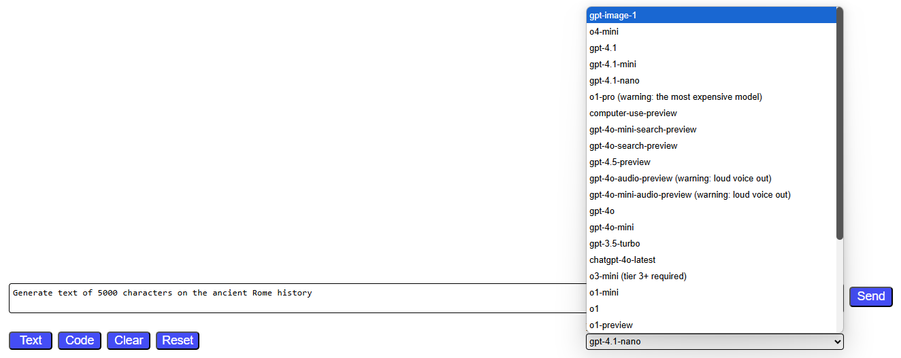

# Overview

This is an educational OpenAI project that I developed for my colleagues to demonstrate the use of streaming outputs with Azure OpenAI and regular OpenAI clients.

This project highlights:

- The use of streaming outputs in OpenAI / Azure OpenAI.
- A clear, visually noticeable difference in the streaming performance between the older gpt-4o-mini / gpt-4o models and the newer o1-mini / o1-preview language models.
- Testing keyless Entra ID authentication in Azure OpenAI.
- The ability to cancel an ongoing streaming request using the **Stop** button.
- Options to formatting AI outputs for code blocks and markdown content.
- Working with chat history context.

Technical stack:

- Node.js, Express server, OpenAI module, @azure/identity for API key and keyless Entra ID authentication, plain JavaScript, and index.html.
- highlight.js, marked.js

### Updates and bug fixes:

**February 8, 2025, v1.0.3**
- Default configuration does not require Azure OpenAI. Use your regular OpenAI endpoints and explicitly configure specific ones to be handled by Azure OpenAI. Colleagues commented that they did not have access to Azure OpenAI outside Microsoft environment.
- Added o3-mini, o1, o1-2024-12-17, gpt-3.5-turbo, and gpt-4-32k-0314 to available default selections. You can add more models to index.html.
  - As of Feb 8, 2025, the model o3-mini were available for OpenAI users that have Tier 3 or higher.
  - The full models o1 and o1-2024-12-17 did not have the streaming option in API. I added fallback to the regular handling to support these models.
- Added sample code- and text- prompts rotated by new buttons **Code** and **Text** respectively; added **Clear** and **Reset** buttons.


Bug fixes:
- Fixed the bug with duplicates in the conversation history that appeared after the second request.
- Fixed the bug with node --watch. This experimental switch caused infinite loops occasionally. For instance, when I used **npm run dev** on the first load. I replaced node --watch with the old good nodemon. Now **npm run dev** can be used for the dynamic reloads on file updates.

# Getting started

Clone the project repository, open it in your preferred editor, such as Visual Studio Code.

Create your own **.env** file using env.example as a template, and adjust your values as needed.

```bash
AZURE_OPENAI_ENDPOINT=https://<your-azure-openai-instance>.openai.azure.com
# Comment out the next line if you are going to use Azure OpenAI keyless authentication. Start your express server using node server-entraid.js instead of node server.js.
AZURE_OPENAI_API_KEY=<your apiKey for Azure OpenAI> # Unless you use keyless
...
OPENAI_API_KEY=<your apiKey for regular OpenAI> # This key is used by o1-mini and o1-preview models unavailable at Azure OpenaI as of December 1, 2024
```

npm i

node server.js

http://localhost:3000


# Minimal ChatGPT server powered by express.js with streaming outputs

By default, the server supports the following types of requests to OpenAI instances:

- Azure OpenAI with \<api-key\>
- Azure OpenAI with keyless authentication using the Entra ID provider
- OpenAI with Bearer \<apiKey\>

The following deployments should be established on your Azure OpenAI instance:

- gpt-4o
- gpt-4o-mini

Additionally, there should be two active models available at your OpenAI API (prepaid API service):

As of December 1, 2024, o1-models are not yet publicly available in Azure OpenAI. The server utilizes these models through the regular OpenAI API subscription.

- o1-mini
- o1-preview

You can adjust the specific models used in the file public/index.html.

```html
<select class="model">
  <option value="gpt-4o-mini" selected="true">gpt-4o-mini</option>
  <option value="gpt-4o">gpt-4o</option>
  <option value="o1-mini">o1-mini</option>
  <option value="o1-preview">o1-preview</option>
</select>
```

You can also change target endpoint routings - to azureopenai or openai - at the header of public/browser-page.js (public/browser-console.js for the console client).

By default, requests to language model endpoints are handled by the regular OpenAI.
You can reconfigure specific models to be handled by Azure OpenAI and/or the regular OpenAI.
- Uncomment corresponding lines.

```javascript
const targetEndpoints = {
  //"4o": "azureopenai",
  //"o1": "openai",
  "default": "openai"
};
```

### User interface with streaming output, which consumes data from the server

Open http://localhost:3000 in your browser.

Alternatively, you can open public/index.html from the local folder and click the **Send** button.

### Browser console client with streaming output, which consumes data from the server

Execute public/browser-console.js in the browser's console available by pressing F12 in Chrome.

# How to test keyless authentication for Azure OpenAI on this express server

To test keyless (Entra ID) authentication locally, follow these steps:

1. Install Azure Cli (az) on your machine: https://learn.microsoft.com/en-us/cli/azure/install-azure-cli

2. Open your OpenAI resource in the Azure portal, navigate to **Access Control (IAM)** and add the role **Cognitive Services OpenAI User** to your Entra ID account.

3. Open your **.env** file. Comment out or remove the line AZURE_OPENAI_API_KEY=...

4. Login to your Azure Portal using the following command. Select your subscription for the Azure AI resource if required:
   - az login --scope https://cognitiveservices.azure.com/.default
     
5. Run the server using the following command: **node server-entraid.js**. Keyless authentication should start to work.

# Useful links

https://learn.microsoft.com/en-us/azure/ai-services/openai/chatgpt-quickstart?tabs=command-line%2Cjavascript-key%2Ctypescript-keyless%2Cpython-new&pivots=programming-language-javascript

https://techcommunity.microsoft.com/blog/azuredevcommunityblog/using-keyless-authentication-with-azure-openai/4111521
